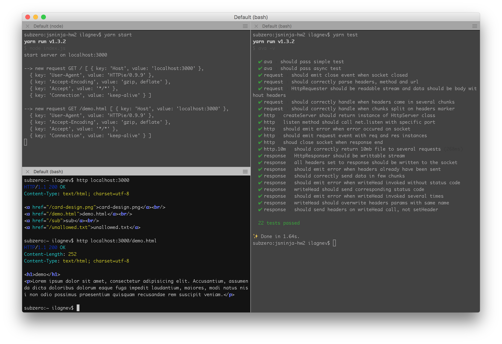

# simple http server with unit tests

module httprr provide simple implementation of standart node's http module.

main task of this project was build module and cover it with tests.

---
task description placed here [second task (server)](https://gist.github.com/xanf/59cd460970f00fd04609fd0b2b071d87#file-task-02-md) and [third task (tests)](https://gist.github.com/xanf/59cd460970f00fd04609fd0b2b071d87#file-task-03-md)